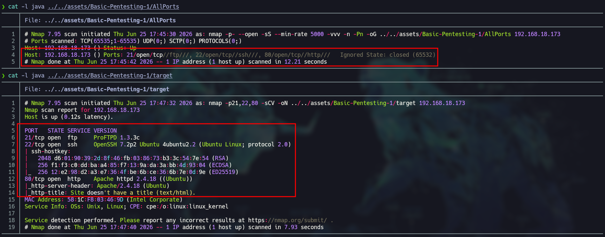
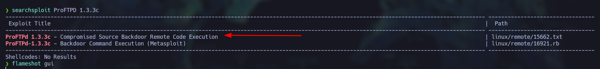
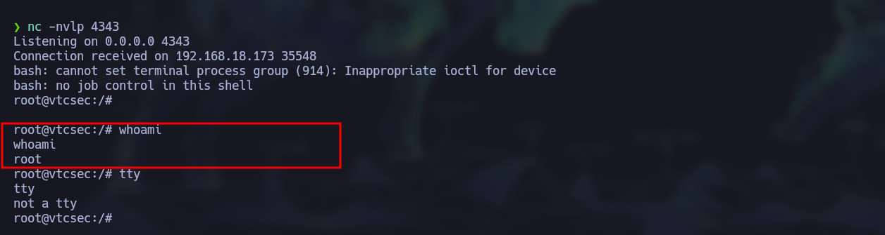
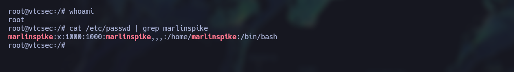

# 🚩 Basic-Pentesting-1

**Estado**: 🛠️ Completada | ⚖️ Dificultad: [Easy]
**IP Objetivo**: 192.168.18.173
**SO**: Linux (Ubuntu)

---

## 🎯 Resumen Técnico
*   **Vectores de Ataque**: [PORT FTP]
*   **Escalada de Privilegios**: [ProFTPd 1.3.3c - Compromised Source Backdoor Remote Code Execution]
*   **Habilidades Clave**: [nmap, python3]

---

## 📑 Metodología de Resolución

### 1. Reconocimiento (Recon)
> Documentación de puertos y servicios con Nmap.
Una vez hayamos encontrado la IP de la maquina víctima (192.168.18.173) podemos iniciar con la fase de Enumeración para identificar vectores de entrada.
* Escaneo de puertos con Nmap
    Para esta sección podemos usar los siguientes 2 comandos que son los mas practicos para un reconocimiento mas fácil, un escaneo de los 656535 puertos para ver cuales estan abiertos y una vez nos arroje la salida podemos continuar con un escaneo mas profundo de estos para ver que contienen o como funcionan.
    **1) Resultado**
    Usando los comandos:
    ```bash
    sudo nmap -p- --open -sS --min-rate 5000 -vvv -n -Pn 192.168.18.173 -oG Allports
    sudo nmap -p21,22,80 -sCV 192.168.18.173 -oN target
    
    ```
    *Hallazgo: se encontraron los puertos 21,22 y 80, **el puerto 21** es usado para las conexiones de control y autenticación FTP, el **puerto 22** es usado para las conexiones SSH y el **puerto 80** que es el puerto de red por default.
    
    *(Reconocimiento y vizualizacion de los servicios que corren en los puertos)*

### 2. Análisis de Vulnerabilidades
> Identificación de fallos y vectores de entrada.
* Usando searchsploit podemos encontrar que el servicio FTP en el puerto 21 es vulnerable, buscando en searchsploit popdemos encontrar que la version **ProFTPd 1.3.3c** es vulnerale a un  ***Compromised Source Backdoor Remote Code Execution*** por lo que si encontramos la forma de entrar podemos ejecutar código malicioso.

*(ProFTPd 1.3.3c - Compromised Source Backdoor Remote Code Execution)*


### 3. Explotación
> Ejecución de payloads y obtención de acceso inicial.
* Para poder obtener acceso mediante el puerto 21, debemos saber que esta vulnerabilidad viene de una puerta trasera que un hacker escondio en uno de los paquetes que puede accederse mediante un playload que debe contener *"HELP ACIDBITCHEZ"* el cual entablara una shell completamente interativa como root. para mas información de esta vulnerabilidad buscar la **CVE-2010-20103** esta hecho para entablar la conexión usando lenguaje c,pero podemos hacer lo mismo con python si nos entablamos una reverse shell.

Para el acceso inicial usaremos el script [Backdoor.py](../../scripts/Basic-Pentesting-1/Backdoor.py) si quieres usarlo debes de cambiar la ip de atacante por la tuya para que se pueda entablar una reverse shell, por defecto se usa el puerto 4343, por lo que debes tener una terminal abierta usando netcat.

```bash
nc -vnlp 4343
```
Ejecutando el script tenemos los siguiente:

**(Vector de entrada)**
teniendo esto debemos de hacer un tratamiento de la tty para tener una shell completamente interactiva. y con eso tenemos acceso completo a la maquina, aunque no exita una bandera para buscar ya que esta maquina no esta destinada a un CTF podemos concluir mostrando las credenciales que estan en **/etc/shadow**


***(CREDENCIALES)***
### 4. Post-Explotación
> Enumeración interna y escalada de privilegios a Root.
*   NO ES NECESARIA PUESTO QUE LA CONSOLA YA TIENE PRIVILEGIOS ROOT

### 5. Reporte y Mitigación
> Propuestas de endurecimiento (Hardening) del sistema.
*   Para esta maquina el unico vector por cuidar y el mas importante es el actualizar el sistema y servicios que tiene, para asi evitar estos posibles ataques con herramientas que ya han sido vulnerables.

---

## 📂 Archivos Relacionados
*   **Scripts**: [../../scripts/Basic-Pentesting-1/]
*   **Evidencia**: [../../assets/Basic-Pentesting-1/]
