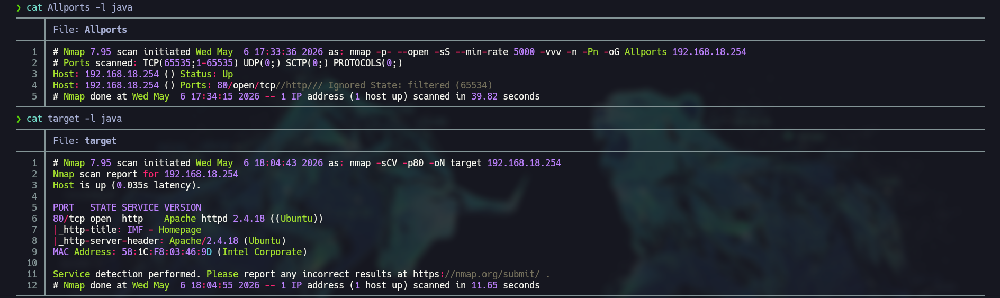
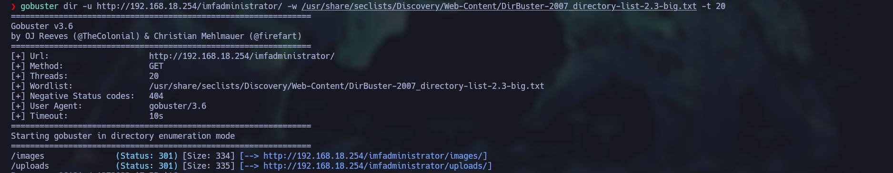

# 🚩 VulnHub-IMF

**Estado**: 🛠️ En Progreso | ⚖️ Dificultad: [MEDIA]
**IP Objetivo**: 192.168.18.254
**SO**: Linux 

---

## 🎯 Resumen Técnico
*   **Vectores de Ataque**: [Ej. Bypass de WAF, RCE]
*   **Escalada de Privilegios**: [Ej. Buffer Overflow, SUID]
*   **Habilidades Clave**: [Ej. Estabilización de TTY, GDB-Peda]

---

## 📑 Metodología de Resolución

### 1. Reconocimiento (Recon)
Una vez identificada la IP de la máquina víctima (`192.168.18.254`), iniciamos la fase de enumeración para identificar vectores de entrada.

**Escaneo de puertos abiertos:**
Utilizamos `nmap` para un escaneo rápido de todo el rango de puertos (65535), priorizando la velocidad y exportando el resultado en formato *grepeable*:

```bash
nmap -p- --open -sS --min-rate 5000 -vvv -n -Pn 192.168.18.254 -oG AllPorts
```

* **Resultado**: Solo se detectó el **puerto 80** abierto, sugiriendo la presencia de un servicio web.

**Enumeración de servicios y versiones:**
Realizamos un escaneo profundo sobre el puerto identificado para obtener detalles del servicio y ejecutar scripts básicos de reconocimiento:

```bash
nmap -sCV -p80 192.168.18.254 -oN target
```

* **Hallazgo**: El servicio es **HTTP** corriendo sobre **Apache/2.4.18**.


*(Captura de pantalla del escaneo de Nmap)*
Como se trata de una página web podemos hacer **URL enumeration** con la herramienta **gobuster** para descubrir posibles vectores de ataque, estaremos usando los diccionarios de la **seclist** para **Web-Content** aun si usamos la versión mediano o grande solo se obtienen 2 direcciones **/uploads** y **images** 


*(captura de pantalla de gobuster)*


### 2. Análisis de Vulnerabilidades
> Identificación de fallos y vectores de entrada.
*   

### 3. Explotación
> Ejecución de payloads y obtención de acceso inicial.
*   

### 4. Post-Explotación
> Enumeración interna y escalada de privilegios a Root.
*   

### 5. Reporte y Mitigación
> Propuestas de endurecimiento (Hardening) del sistema.
*   

---

## 📂 Archivos Relacionados
*   **Scripts**: [Enlace a scripts/VulnHub-IMF]
*   **Evidencia**: [Enlace a assets/VulnHub-IMF]
